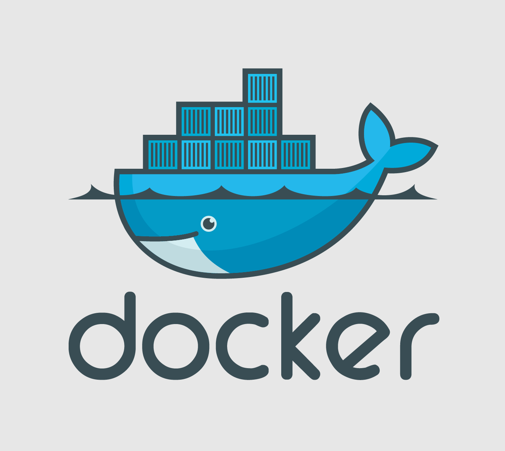
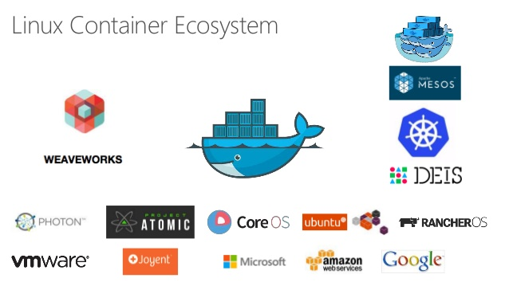

# [fit] Introduction to Docker

### Part 1 — What is Docker and When to use it

###       

### Badar Ahmed

^ Hello. Welcome to this introductory course on Docker.

^ I am Badar Ahmed.

^ And today I will be presenting part 1 of this course, where we will cover some background on Docker and when to use it.

___

# What is Docker?

- New technology launched in 2013.

  ​

- Builds on top of Linux kernel features for OS level virtualization.

  ​

- Isolated containers where processes can run without impacting each other (process, memory, filesystem isolation).

___

# What problems does Docker solve?

- Shipping code is hard. Docker makes it easier.
  ​
- When things break in production, most common developer excuse is *"Works on my laptop"*.
  ​
- Docker provides a standardized container that works for shipping software to different environments.

^ Docker solves these problems by packaging code in a universal format that can be run across different environments in isolated containers.

^ Isolated containers allow us to be sure that a package or its dependencies are not mixing together on disk, in memory or in any other way.

___

# When to use Docker?

- Anywhere where you are deploying software between multiple environments.
  ​
- Docker provides an easy to use and portable way to run same software anywhere.
  ​
- You can run same container on your laptop, same in CI environment and same in production environment.

___

# When to use Docker?

- Docker containers are order of magnitude faster than VMs.
  ​

- They can be ported on virtually any environment that runs relatively latest version of the  Linux Kernel.

  ​

- Can be deployed on Public Cloud (AWS/GCP/Azure), Private Cloud or on Bare Metal.

___

# When **NOT** to use Docker?

- Docker ecosystem is changing very fast as of right now.

  ​

- If you want something mature or stable this is not it.

  ​

- Fully leveraging Docker containers does require rethinking how to refactor or redesign code deployment pipelines.

___

# Container Ecosystem

- Docker is the defacto container engine & format.
- Rocket by CoreOS is another alternative.

- Lower level container primitives like cgroups & LXC are harder to use.
- Docker provides a really nice API on top of those lower level primitives.

___

# Container Ecosystem

- A lot of ecosystem around containers is trying to solve problems of container scheduling,  orchestration, networking & storage.

  ​

- Major container scheduler/orchestrators are Docker Swarm, Nomad, Kubernetes & Mesos.

___

# How does Docker affect DevOps?

- Less sysadmin work.
- Less variance between developer local environment and prod environment.
- Enables more DevOps, since developers can easily package their own code!
- Allows easier integration and end to end testing.

___

# [fit] Thanks!